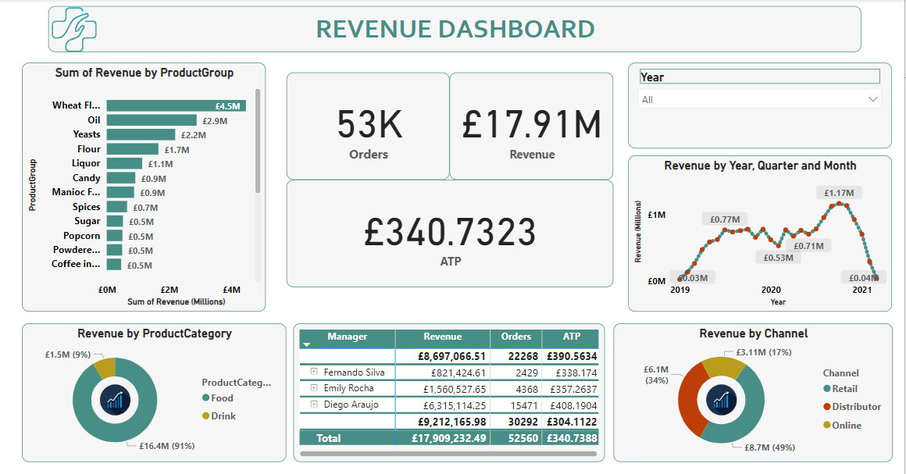

# Sales-Analysis

## Introduction
This is a Sales Analysis on a dataset with 2 tables.

## Data Source
This dataset is an assessment from my data analytics course. The dataset comprises 2 tables(product and sales).

## Data Cleaning 
I carried out the ETL on the imported dataset. The dataset was cleaned. I created a new column to calculate revenue for each product by multiplying quantity and unitPrice. 

## Objective

## Visual Representation
I employed the DAX expression to create new measures for revenue and average ticketing price (ATP).

